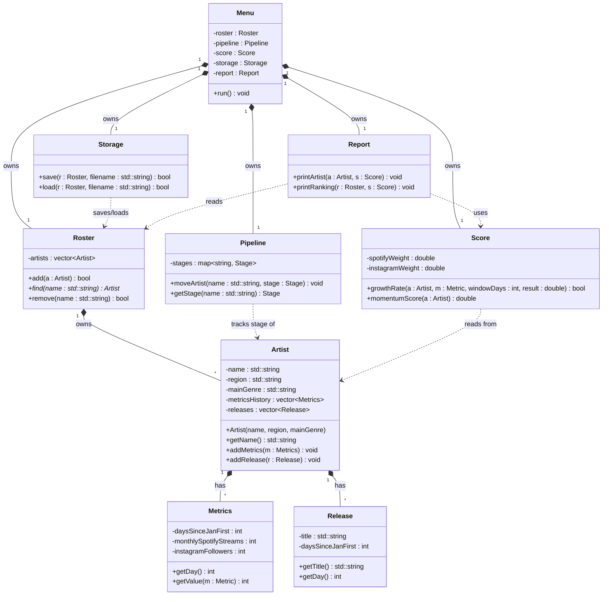

# CIS-25-Major-Project
## Class diagram

```mermaid
classDiagram
	class Artist {
		-name : std::string
		-region : std::string
		-mainGenre : std::string
		-metricsHistory : vector~Metrics~
		-releases : vector~Release~
		+Artist(name, region, mainGenre)
		+getName() std::string
		+addMetrics(m : Metrics) void
		+addRelease(r : Release) void
	}

	%% snapshot of artist metrics
	class Metrics {
        %% arbitrary date to track growth over time
		-daysSinceJanFirst : int
		-monthlySpotifyStreams : int
		-instagramFollowers : int
		+getDay() int
		+getValue(m : Metric) int
	}

	class Release {
		-title : std::string
		-daysSinceJanFirst : int
		+getTitle() std::string
		+getDay() int
	}

	class Score {
		-spotifyWeight : double
		-instagramWeight : double
		+growthRate(a : Artist, m : Metric, windowDays : int, result : double) bool
		+momentumScore(a : Artist) double
	}

	class Pipeline {
		-stages : map~string, Stage~
		+moveArtist(name : std::string, stage : Stage) void
		+getStage(name : std::string) Stage
	}

	class Roster {
		-artists : vector~Artist~
		+add(a : Artist) bool
		+find(name : std::string) Artist*
		+remove(name : std::string) bool
	}

	class Storage {
		+save(r : Roster, filename : std::string) bool
		+load(r : Roster, filename : std::string) bool
	}

	class Report {
		+printArtist(a : Artist, s : Score) void
		+printRanking(r : Roster, s : Score) void
	}

	class Menu {
		-roster : Roster
		-pipeline : Pipeline
		-score : Score
		-storage : Storage
		-report : Report
		+run() void
	}

	Artist "1" *-- "*" Metrics : has
	Artist "1" *-- "*" Release : has
	Roster "1" *-- "*" Artist : owns
	Menu "1" *-- "1" Roster : owns
	Menu "1" *-- "1" Pipeline : owns
	Menu "1" *-- "1" Score : owns
	Menu "1" *-- "1" Storage : owns
	Menu "1" *-- "1" Report : owns
	Pipeline ..> Artist : tracks stage of
	Score ..> Artist : reads from
	Storage ..> Roster : saves/loads
	Report ..> Roster : reads
	Report ..> Score : uses
```